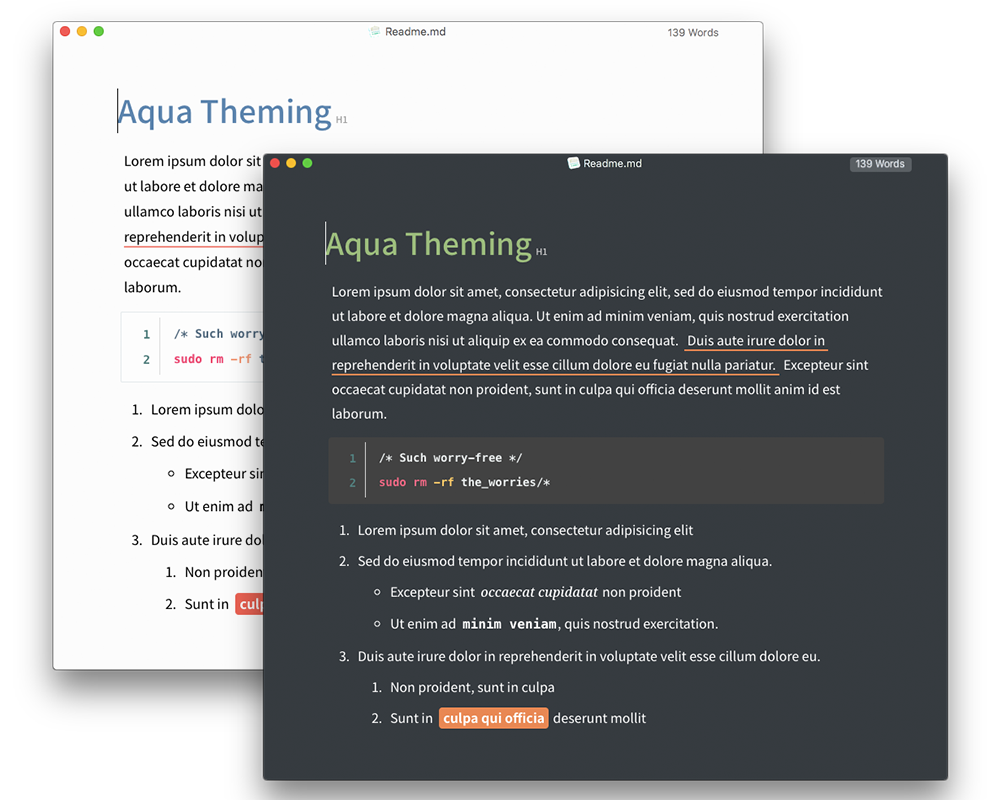
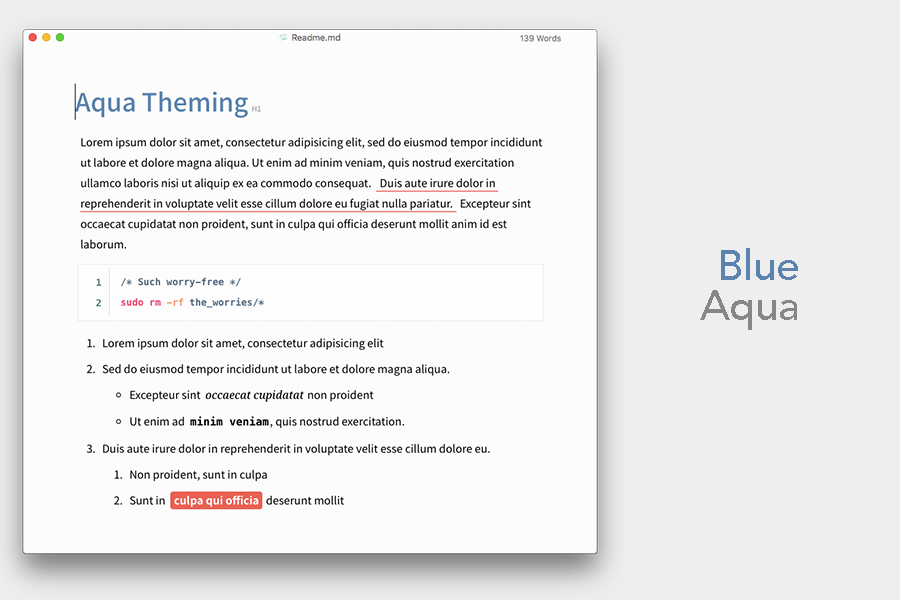
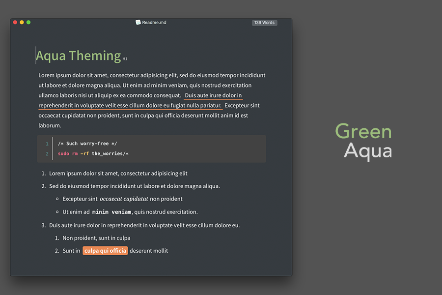
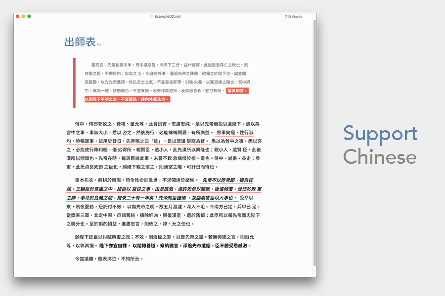
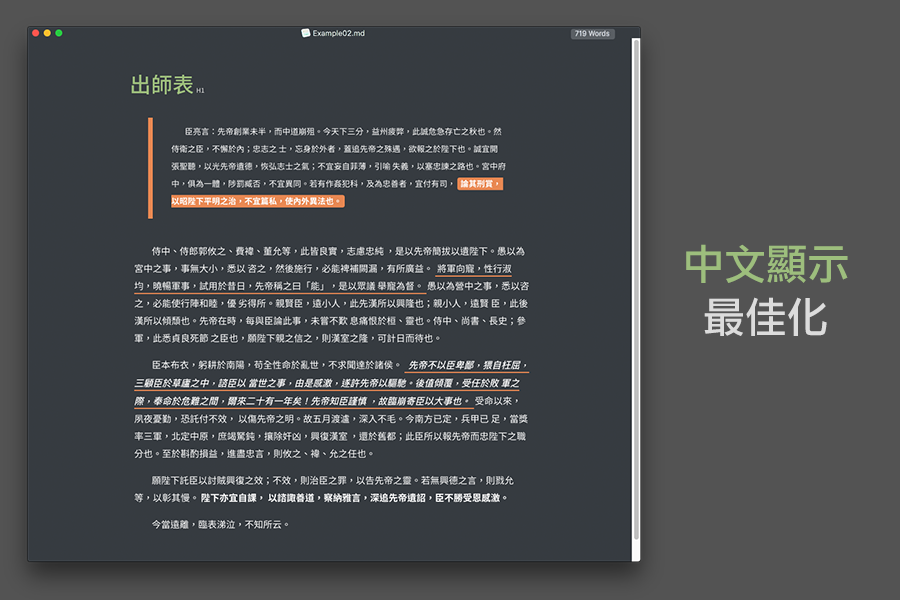

# Aqua Theme

> Aqua --- the whole new experience on Typora

We recommended you to use "Noto Sans CJK TC" and "Noto Serif" to experience the power of Aqua theme.

## Adding Noto Sans and Noto Serif Fonts to Aqua

1. Download Noto Sans CJK TC
[https://noto-website-2.storage.googleapis.com/pkgs/NotoSansCJKtc-hinted.zip](https://noto-website-2.storage.googleapis.com/pkgs/NotoSansCJKtc-hinted.zip)

2. Download Noto Serif
[https://noto-website-2.storage.googleapis.com/pkgs/NotoSerif-unhinted.zip](https://noto-website-2.storage.googleapis.com/pkgs/NotoSerif-unhinted.zip)

3. Unzip Noto Sans CJK TC and Noto Serif Fonts.

4. Copy all of Noto Sans CJK TC fonts to `aqua/CJK_fonts`

5. Copy all of Noto Serif fonts to `aqua/latin_fonts`

